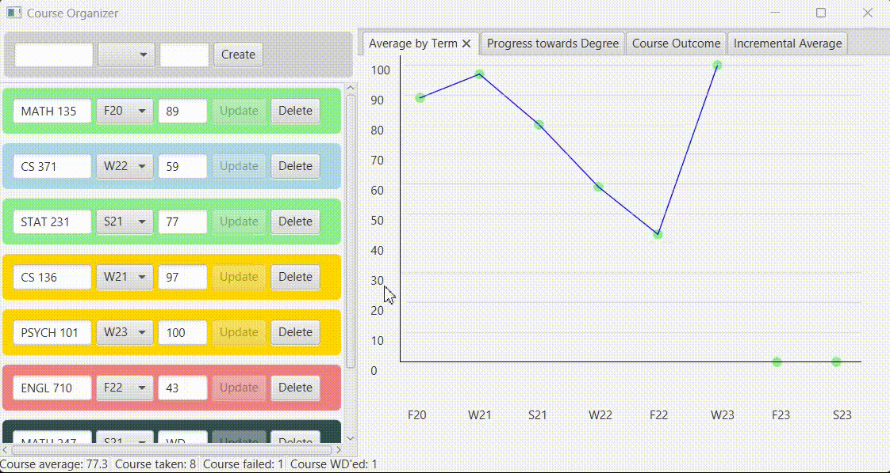

# Course-Organizer

    

## Setup
* Windows 11
* IntelliJ IDEA 2022.3.1 (Community Edition)
* kotlin.jvm 1.7.21
* Java SDK 17.0.6 (temurin)

After cloning to repo, open up IntelliJ IDE and run the _build_ icon on the __HelloApplication.kt__ file.

